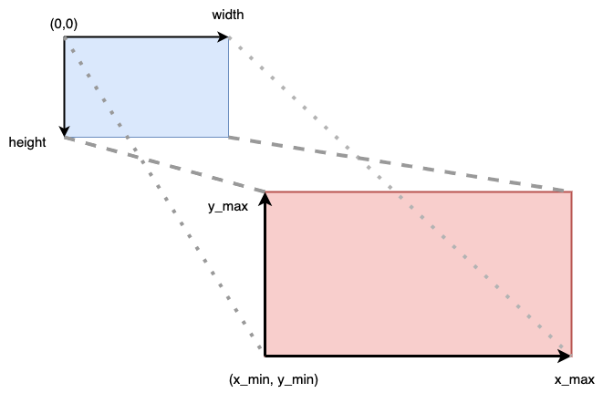

# TP2 Données Géographiques
Auteurs: CAFFIN Clément, SOLANO Bastien

## Introduction

### Lancement de l'application
L'application web se lance en ouvrant le fichier client/index.html dans un navigateur.

Pour que cela fonctionne, il faut au préalable avoir lancé le serveur WMS:
```console
python3 server/WMSserver.py
```

(Modules python nécessaires: psycopg2, pyproj, cairo)

### Code source
Le code du serveur est implémenté dans la méthode do_GET.

Cette dernière appelle la fonction create_tile() du fichier server/gen_img.py


## Fonctionnement

### Requête SQL
La requête faite à la base de données est la suivante:
```sql
select ST_AsText(ST_Transform(linestring, 3857)) \
    from ways \
    where tags ? 'highway' \
    and ST_Contains(ST_MakePolygon( \
    ST_Transform( \
    ST_GeomFromText(\
    'LINESTRING(\
    {p1}, {p2}, {p3}, {p4}, {p1})', {srid}), 4326)), bbox);
```

On créée le rectangle englobant donné par les coordonnées p1, p2, p3 et p4 dans le système srid par:
```sql
ST_Transform( \
    ST_GeomFromText('LINESTRING({p1}, {p2}, {p3}, {p4}, {p1}', {srid})
    , 4326))
```

Puis on cherche tous les chemins contenus dedans grâce à ST_Contains. (Comme on veut savoir ce qui est dans le rectangle englobant, il suffit de tester si le rectangle englobant de la figure est dans notre rectangle).

Enfin, on projète le résultat dans le système de coordonnées EPSG:3857 (Celui qui est utilisé par OpenStreetMap et Google Maps entre autres).

### Dessin de l'image

On obtient en résultat un itérateur sur des ST_LineString.
Chacun est un ensemble de points cartésiens (x, y) où:
$x_{min} \leq x \leq x_{max}$ et $y_{min} \leq y \leq y_{max}$.
($x_{min}$,$x_{max}$, $y_{min}$ et $y_{max}$ sont les coordonnées du rectangle englobant que l'on veut).

On fait donc la transformation affine suivante:
$$
x := width * \frac{x - x_{min}}{x_{max} - x_{min}}
$$
$$
y := height * \left(1 - \frac{y - y_{min}}{y_{max} - y_{min}}\right)
$$

On a alors des coordonnées en pixels dans l'image (en arrondissant à l'entier le plus proche).

Cette transformation correspond au schéma suivant:



On appelle alors la méthode draw_linestring() de la Classe Image (server/drawer.py).

Voici le résultat que l'on obtient sur une tuile (on dessine arbitrairement les chemins en rouge):


### Serveur WMS

Notre serveur accepte une URL de la forme:

```url
http://localhost:4242/wms?request=GetMap&layers=tp&height=100&width=100&srs=EPSG:3857&bbox=634521.10,5637278.20,645653.05,5653062.54
```

Avec les paramètres:

 - request: Valeur 'GetMap' exigée.
 - layers: Valeur définie par l'appelant
 - height: Hauteur de la tuile résultante en pixels
 - width: Largeur de la tuile résultante en pixels
 - srs: Le système de coordonnées dans lequel on donne le rectangle. Pour ce TP, on force cette valeur à être 'EPSG:3857' (attention aux majuscules)
 - bbox: les coordonnées du rectangle dans le système srs

 Dans le cadre de TP, notre serveur renvoie une erreur 404 si l'un des paramètres est manquant ou si sa valeur est incorrecte. (Nous sommes conscients que ce n'est pas comme ça qu'il faudrait faire sur un logiciel plus abouti)

 ### Système de cache

 Notre serveur met en cache toutes les tuiles générées.
 Pour cela, l'image PNG est appelée "'width'x'height'.png".
 
 Elle est placée dans un dossier au nom des coordonnées du rectangle englobant. Par exemple, pour l'url du chapitre précédent, cela donne:

 ```
 ./634521_10x5637278_20X645653_05x5653062_54/100x100.png
 ```

A chaque nouvelle requête, on regarde si l'image existe déjà en cache. Si c'est le cas, on renvoie le chemin vers l'image.
Sinon, on la créée.


 ### Client web

 On peut donc utiliser la libraire javascript leaflet pour le visualiser une carte intéractive dans un navigateur.

Voici le résultat:


## Retour critique

### Mise à l'échelle

Nous n'avons pas imposé de limite à la mise en cache, ni en terme de volume ni en terme d'ancienneté.

Cela pose un premier problème: le système peut vite être à cours d'espace disque. Dans ce cas, cette "optimisation de performances" et contre-productive.

Ensuite, si une tuile a déjà été générée elle sera ré-utilisée pour toute requête ultérieure (même 10 ans après...). Les tuiles ne sont donc plus à jour au bout d'un moment. Pour remédier à cela il faut supprimer le cache à la main dans notre cas (nous n'avons pas automatisé cela).

### Performances

Nous n'avons malheureusement pas fait d'analyse quantitative de l'amélioration des performances par le système de cache. Nous remarquons tout de même une amélioration car les requêtes à la base sont très longues à effectuer (d'autant plus à travers le VPN, les jours précédent le rendu où les étudiants font beaucoup de requêtes à la base en même temps...).